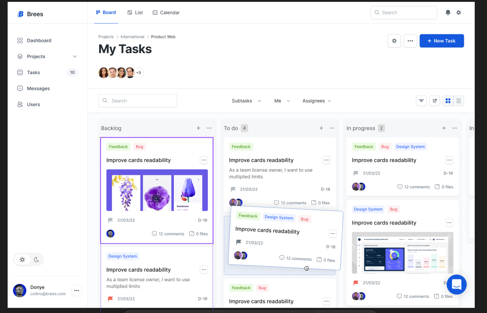
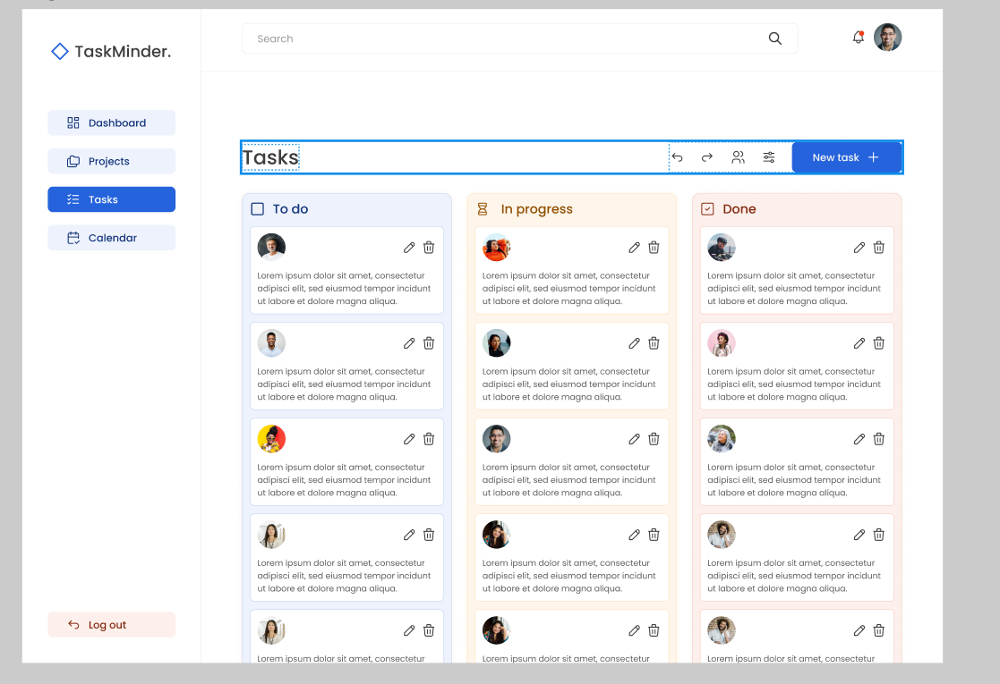

# EduTrack AI

Projeto da disciplina Innovation Lab – Faculdade Impacta
Aluno: Gabriel Sampaio
2025/2026

## Tecnologias Utilizadas

- Git & GitHub
- VS Code
- Node.js
- OpenSpec
- Xano




## Scripts

### scripts/calculate_progress.py

Small utility to compute progress percentage (completed / total) and return JSON.

CLI example:

```bash
python scripts/calculate_progress.py --completed 3 --total 5
# => {"completed": 3, "total": 5, "percentage": 60.0, "unit": "%"}
```

Library example:

```python
from scripts.calculate_progress import calculate_progress

result = calculate_progress(3, 5)
print(result)
```
